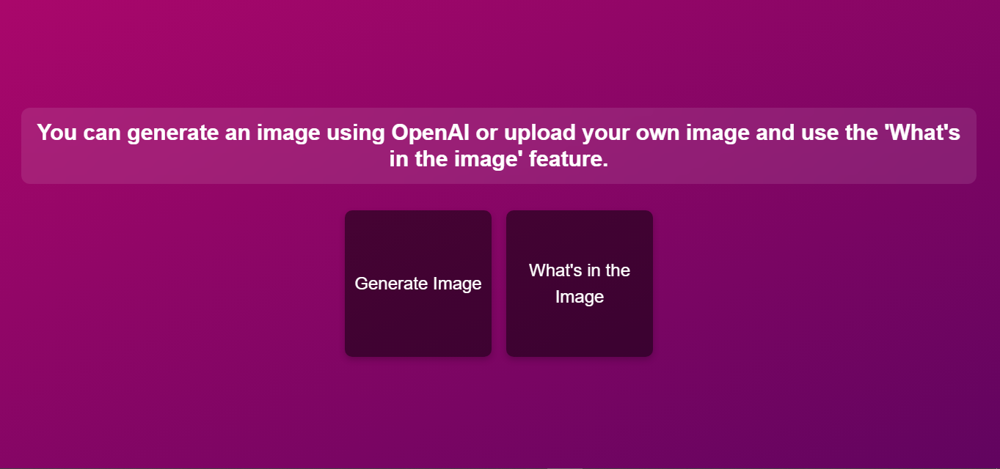
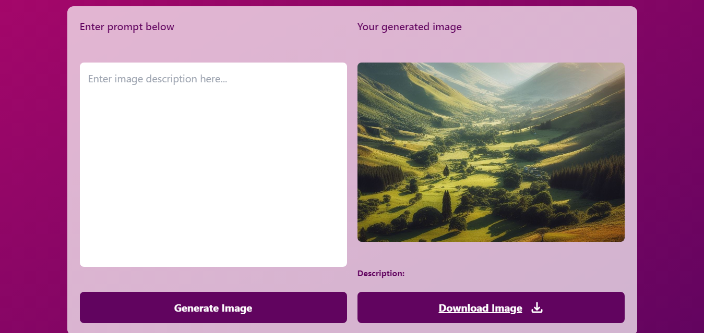
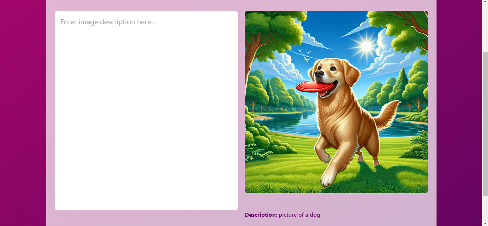
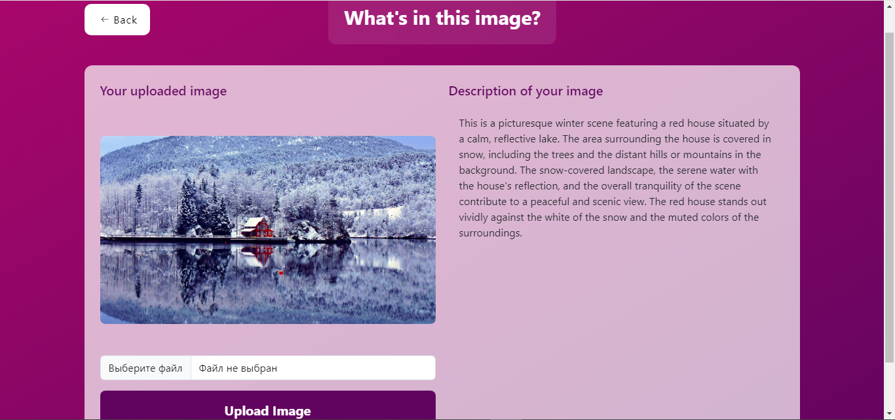

# ImageGenVision

## Table of Contents
- [ImageGenVision](#imagegenvision)
  - [Table of Contents](#table-of-contents)
  - [Project Description](#project-description)
  - [Features](#features)
  - [Installation](#installation)
    - [Prerequisites](#prerequisites)
    - [Steps](#steps)
  - [Screenshots](#screenshots)
  - [Contact](#contact)

## Project Description
**ImageGenVision** is a web application built with Django that leverages OpenAI's DALL-E-3 and GPT-4 models to provide two main functionalities:
1. Generate images based on user prompts.
2. Describe uploaded images.

The application allows users to either enter a prompt to generate an image or upload an image to get a detailed description of it.


## Features
- Generate images based on text prompts using OpenAI's DALL-E-3 model.
- Upload images and receive descriptive text using OpenAI's GPT-4 vision capabilities.
- Download generated images.
- User-friendly interface for both generating images and uploading photos for description.


## Installation
### Prerequisites
- Python 3.x
- All libraries specified in `requirements.txt`
- OpenAI API Key
- Django security key
  
### Steps
1. Clone the repository:
    ```bash
    git clone https://github.com/shevchenkkko/ImageGenVision.git
    ```
2. Create a virtual environment and activate it:
    ```bash
    python -m venv venv
    source venv/bin/activate  # On Windows use `venv\Scripts\activate`
    ```
3. Install the required packages:
    ```bash
    pip install -r requirements.txt
    ```
4. Set up the environment variables:
    - Create a `.env` file in the root directory and add the following variables:
      ```
      SECRET_KEY=your_secret_key
      DEBUG=True  # or False in production
      OPENAI_API_KEY=your_openai_api_key
      ```
    - To generate a `SECRET_KEY`, you can use [Django Secret Key Generator](https://djecrety.ir/)
    -  Ensure you have sufficient balance on your OpenAI account.
5. Apply the migrations:
    ```bash
    python manage.py makemigrations
    python manage.py migrate
    ```
6. Start the development server:
    ```sh
    python manage.py runserver
    ```
## Screenshots
Here are some screenshots of the application:

- **Screenshot 1: Application Home Page**
  

- **Screenshot 2: Image Generation Feature**
  
  

- **Screenshot 3: Image Description Feature**
  

## Contact
If you have any questions or suggestions, please feel free to contact me through my [GitHub profile](https://github.com/shevchenkkko).